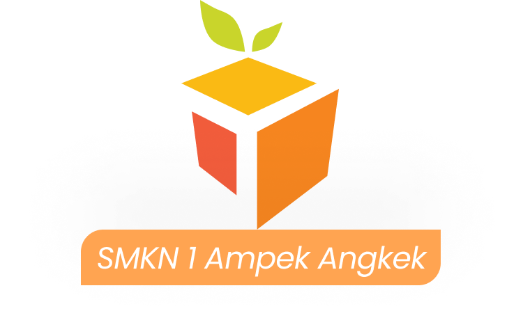
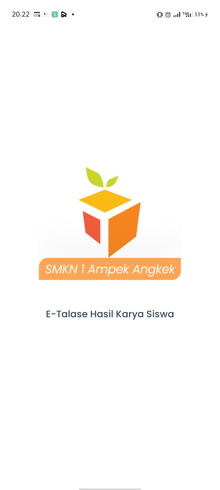
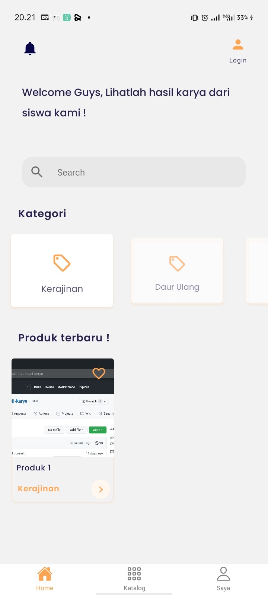
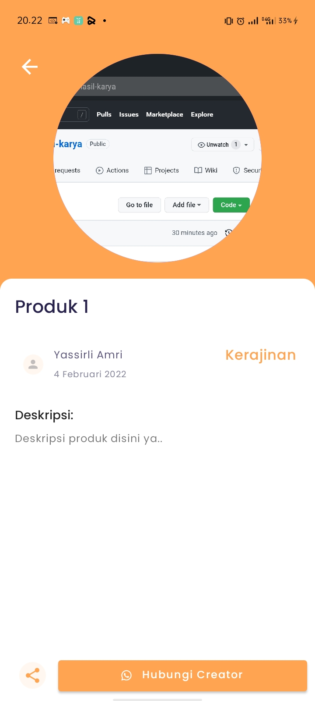

# Etalase Hasil Karya Siswa

Sebuah aplikasi e-talase hasil karya inovatif siswa SMK berbasis mobile, dikembangkan dengan React Native.

<p align="center">
  
  
</p>

# Screenshot

<p align="left">
  
  
  
  
</p>

## Step-by-step

### Download

Download file repository dari github,

ekstrak folder project`.

jalankan cmd atau terminal .

masuk ke repository folder project, lalu ketikan npm install untuk install package

setelah selesai, kemudian di running.

### Running App

```
npx react-native start

npx react-native run-android

```
